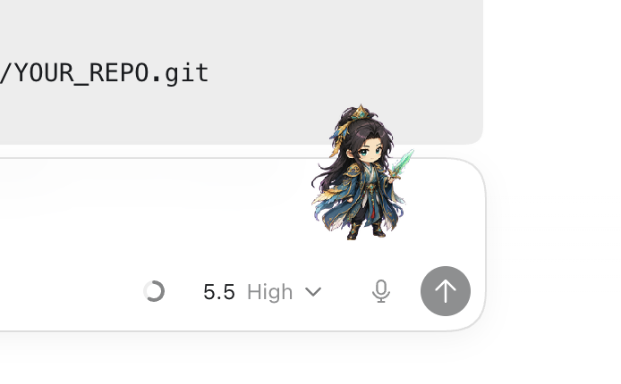
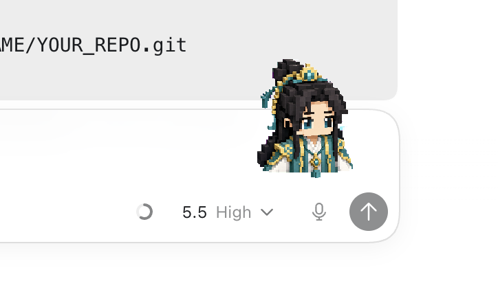

# Codex Pets

Two custom Codex pets:

- `han-tianzun` / `韩天尊`
- `han-yuanying` / `韩元婴`

## Preview





## Install

Clone or download this repo, then copy the pet folders into your Codex pets directory:

```bash
mkdir -p ~/.codex/pets
cp -R han-tianzun ~/.codex/pets/
cp -R han-yuanying ~/.codex/pets/
```

Restart Codex after copying the folders.

## Select A Pet

Open Codex, then go to:

```text
Settings -> Appearance -> Pets
```

Choose either `韩天尊` or `韩元婴`.

In a Codex thread, you can also use:

```text
/pet
```

to show or hide the pet.

## Pet Folder Format

Each pet only needs two files:

```text
pet.json
<spritesheet file referenced by pet.json>
```

This repo keeps each pet folder minimal so it can be copied directly into `~/.codex/pets`.
